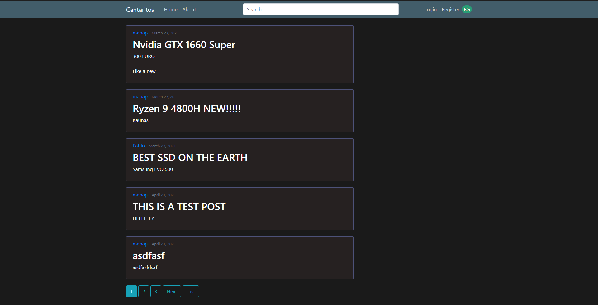
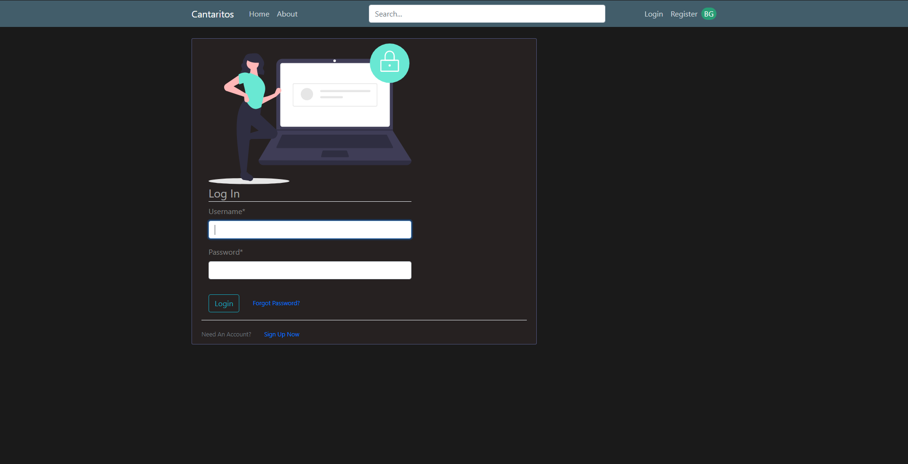
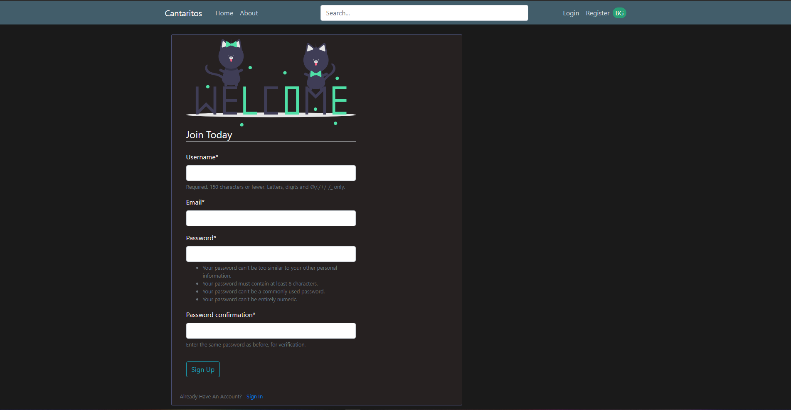
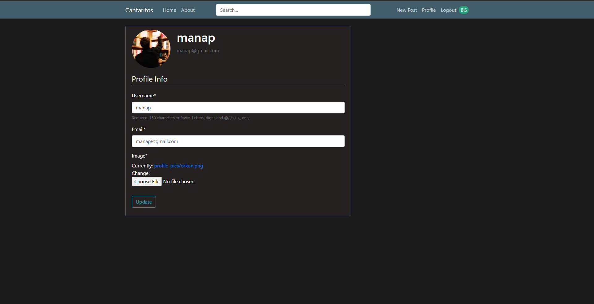
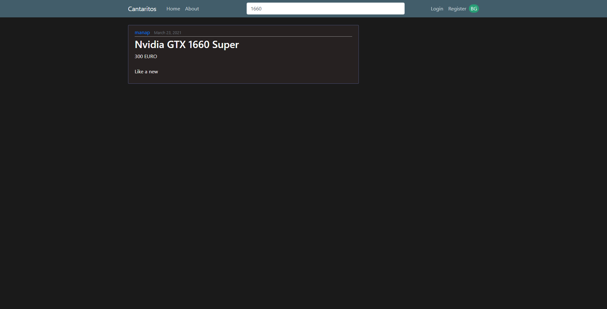
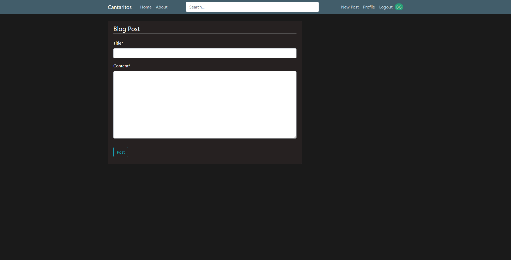
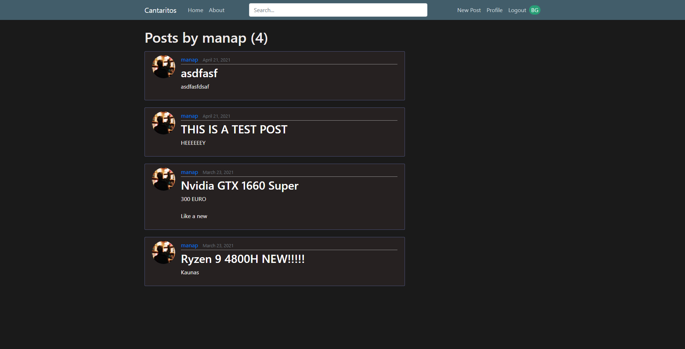

# CantaritosBlog

Cantaritos Blog is a blog page developed with Django Framework for the Software Engineering course.

<b>Cantaritos Team:</b>

@manaporkun - Backend Developer

@pablinpc99 - Backend Developer

@LeQuXi - Frontend Developer

<b>Screenshots:</b>

